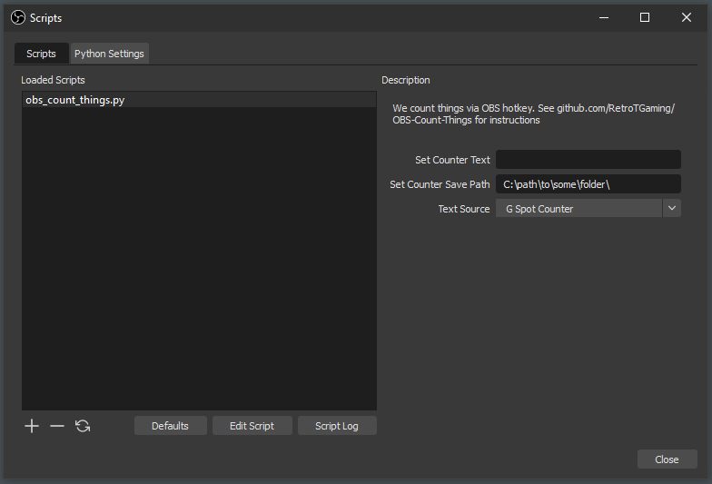
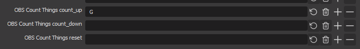
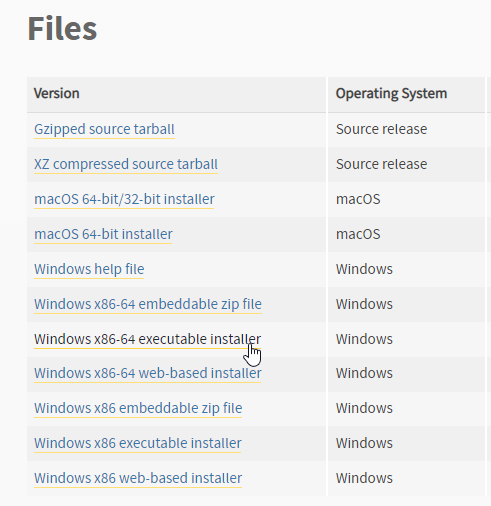
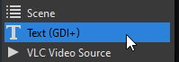
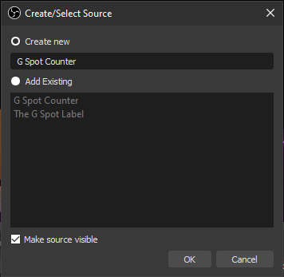
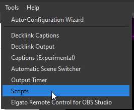

# RetroT Presents: OBS Count Things
This is a Python script that implements a hotkey counter in OBS studio which can be applied to a text source.

Just a warning; this project is not very well tested. I forked the Obscounter project because it was lacking a few key features that I wanted (such as persisting counters between streams), but you shouldn't consider this production quality code.

# Setup

If you don't know ANYTHING about coding or Python, that's fine. I've posted a YouTube video which walks through this step-by-step on top of these text instructions.

I'm only going to give these instructions for Windows. First, because I don't own a Mac and so I cannot test it on a Mac. And second, because 99.9999% of people who are gaming and streaming are doing so on Windows.

The version of Python 3 that's used here is VERY important. The script won't even load if your version of Python is wrong. I wrote and tested this script using Python 3.6.8. 

To install Python 3.6.8 head to this url and download the Windows installer: [Python 3.6.8 downloads page](https://www.python.org/downloads/release/python-368/)

Download the Windows x86_64 executable installer. If you're running on 32-bit Windows, lord save you. If you want to install this using fancy shit like WSL or building from source, then you don't need me to help you work this script. I'm lazy and the Windows installer does everything you need.

Click the installer and walk through using defaults. A PATH will be shown to you at some point during the installation, I'll give you the default below, but I would highly recommend writing this down. You'll need it later during the configuration stage of this project.

Next, you'll want to download the actual Python script that we're going to be using. 

Now that Python is installed, open up OBS. Before we go about configuring anything, add a text source to your scene.

IMPORTANT: remember the name of the text source you created. We're going to use this later to write the counter into. The actual text that you put in this box is just a placeholder and won't matter.

Now, this is where the boys are separated from the bigger boys. Open the scripts menu and don't worry if none of the words on the screen make sense. Hit Tools -> Scripts. 

Everything will be empty here (most likely). 

For windows install [python3.6](https://www.python.org/downloads/release/python-368/) 64 or 32 bit depending on your OBS 
- Create text source
- Open `Tools>Scripts` 
- Make sure Python path is not empty
- Add and select this script
- Set settings for it
- Set hotkeys in `File>Settings`

If you need additional COUNTERS , copy paste `hotkey_counter.py` , and add it again

# Contribute 
Submit and MR, issue, or comment and I'll happily review.
