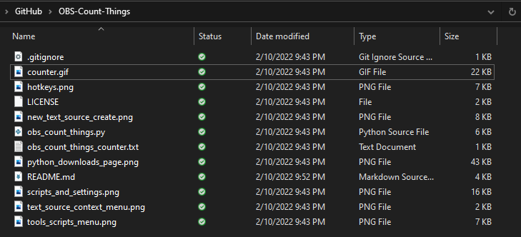
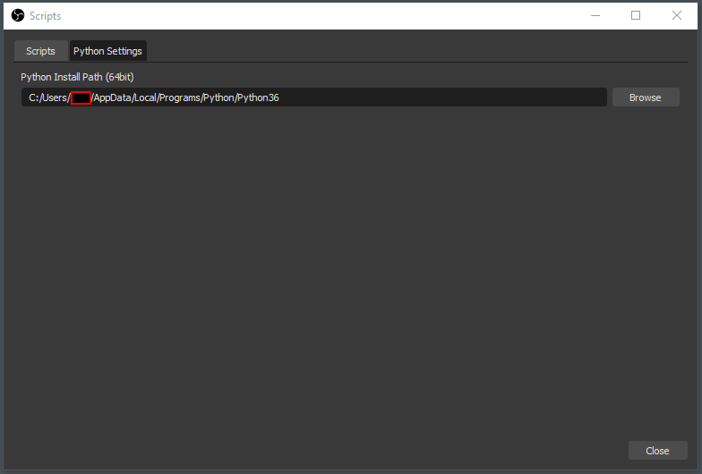
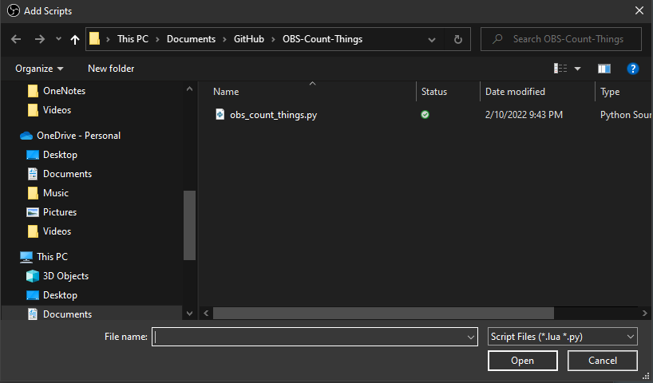
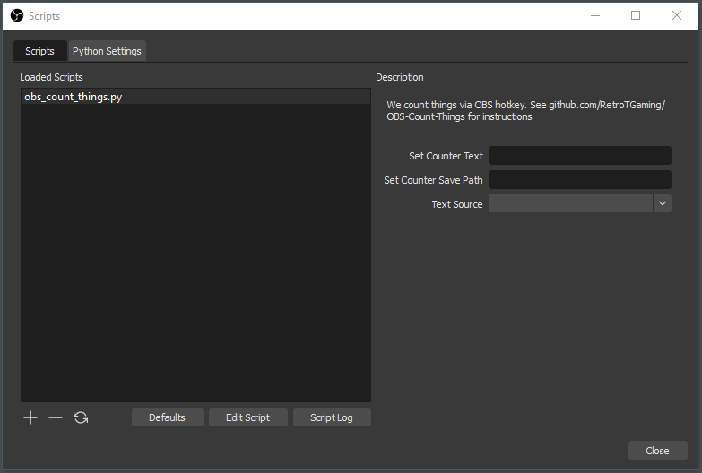
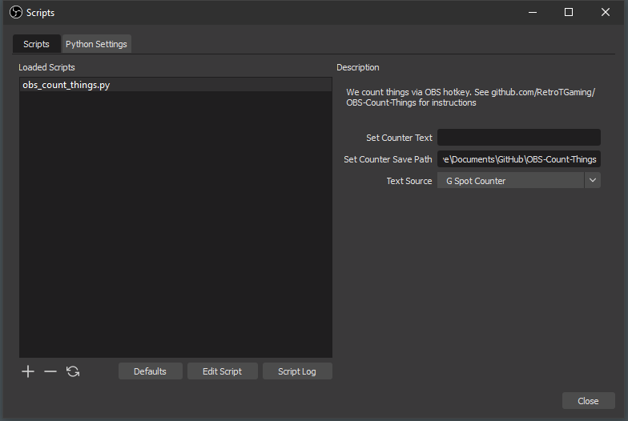
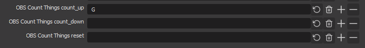

# RetroT Presents: OBS Count Things
This is a Python script that implements a hotkey counter in OBS studio which can be applied to a text source.

Just a warning; this project is not very well tested. I forked the Obscounter project because it was lacking a few key features that I wanted (such as persisting counters between streams), but you shouldn't consider this production quality code.

# Setup

If you don't know ANYTHING about coding or Python, that's fine. I've posted a YouTube video which walks through this step-by-step on top of these text instructions.

I'm only going to give these instructions for Windows. First, because I don't own a Mac and so I cannot test it on a Mac. And second, because 99.9999% of people who are gaming and streaming are doing so on Windows.

The version of Python 3 that's used here is VERY important. The script won't even load if your version of Python is wrong. I wrote and tested this script using Python 3.6.8. 

To install Python 3.6.8 head to this url and download the Windows installer: [Python 3.6.8 downloads page](https://www.python.org/downloads/release/python-368/)

Download the Windows x86_64 executable installer. If you're running on 32-bit Windows, lord save you. If you want to install this using fancy shit like WSL or building from source, then you don't need me to help you work this script. I'm lazy and the Windows installer does everything you need.

Click the installer and walk through using defaults. A PATH will be shown to you at some point during the installation, I'll give you the default below, but I would highly recommend writing this down. You'll need it later during the configuration stage of this project.

Next, you'll want to download the actual Python script that we're going to be using. Put this somewhere you won't accidentally delete it on your system. I put it at `C:/Users/<user>/Documents/`. You can put it wherever you want. Download this zip file and unpack it at this safe location: https://github.com/RetroTGaming/OBS-Count-Things/archive/refs/heads/main.zip

You should see a folder that looks like this somewhere on your PC:

Now that Python is installed and you have the scripts unpacked somewhere safe, open up OBS. Before we go about configuring anything, add a text source to your scene.

IMPORTANT: remember the name of the text source you created. We're going to use this later to write the counter into. The actual text that you put in this box is just a placeholder and won't matter.

Now, this is where the boys are separated from the bigger boys. Open the scripts menu and don't worry if none of the words on the screen make sense. Hit Tools -> Scripts. 

Ignore the first tab for now. Click the Python settings tab and point the install path at the Python 3.6.8 install that you did earlier. 

Click back to the Scripts tab where we're about to make magic happen.

Everything will be empty here (most likely). Hit the plus button and add the `obs_count_things.py` script that you unpacked earlier in these instructions. 

If you successfully setup Python 3.6.8 and successfully loaded the .py file, you should see three settings on the right side of the window. 

There are three settings you can use:
- Set Counter Text: This one will set a prefix in front of the counter. I typically leave this one empty.
- Set Counter Save Path: This one will allow you to save counts between OBS sessions. If you do NOT set this, the counter will reset to 0 EVERY single time OBS restarts. If you want to retain the counter between sessions, set this to a valid path on your system. I usually set this to the same exact path as the OBS script we downloaded, but it's up to you. 
- Text Source: This will point to the text source that you setup earlier. The output of the counter (1, 2, .. 10, .. 14, etc.) will get updated here in realtime on your stream or recorded. 

This concludes the script setup portion. The last stage of the setup process involves binding a hotkey to the increment function. I've not actually tested the decrement or reset hotkeys, so use them at your own risk. I'll update this Readme when I get around to that.

Go to File->Settings. Under Hotkeys find the box labeled `OBS Count Things count_up` and set it to the keybind you'd like. Hit Apply and OK. 

Now, when you press your hotkey, the text source you setup earlier will increment by 1 with every keypress. Here's a quick demo.

# Future Features

One day I'd like to:
- Add an increment setting so you can increment and decrement by a different number than 1.
- Other ideas I'm not going to type out right now.

# Contribute 
Submit and MR, issue, or comment (on Reddit, YouTube, or GitHub) and I'll happily review.
